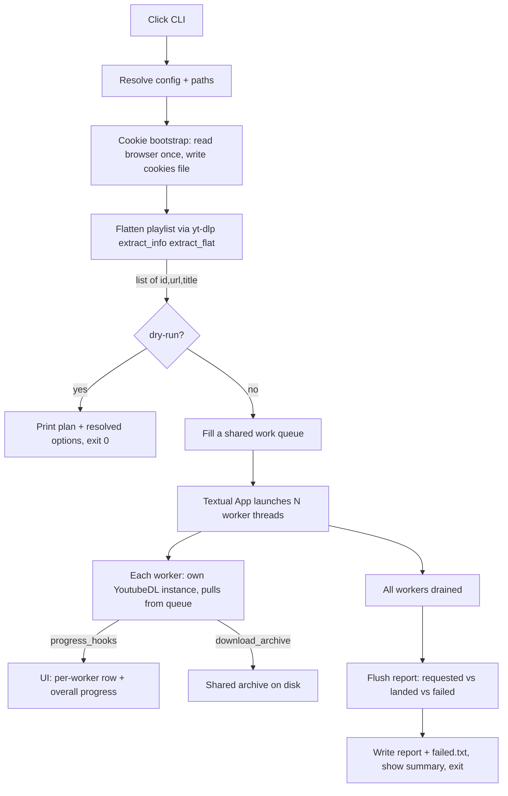

# PRD — `ytdlp-parallel` (Python rewrite)

A command-line tool that downloads a large YouTube playlist with **several
yt-dlp workers running concurrently**, showing each worker's live progress in a
**Textual** terminal UI. It supports a planning **dry-run** and a post-run
**flush** report that reconciles how many videos actually landed versus failed.

> **This document is the source of truth for a fresh implementation.** It assumes
> no prior conversation. A working Bash prototype exists at
> `./ytdlp-parallel.sh` — read it for the download semantics (cookie reuse,
> resume archive, output template), but note the Python version deliberately
> **does not use tmux** and changes the concurrency model (see below).

---

## 0. MANDATORY: use context7 while building this

You **must** use context7 to fetch current documentation for every library you
touch here — **before** you write code against it and **again** whenever you are
unsure of an API. These libraries move quickly and your training data may be
stale. This is not optional.

Per the repository conventions, resolve the library, then fetch docs:

```bash
npx ctx7@latest library "Textual" "<your specific question>"
npx ctx7@latest docs "<resolved /org/project id>" "<your specific question>"
```

At minimum, look up:

- **Textual** — `App` lifecycle, reactive attributes, **Workers** (`@work`,
  `run_worker`, `thread=True`), updating widgets safely from threads
  (`call_from_thread` / custom `Message` posting), `ProgressBar`, `DataTable`
  or `ListView`, `Log`/`RichLog`, and the **testing harness** (`run_test`,
  `Pilot`).
- **Click** — groups and subcommands, options vs arguments, parameter types
  (`click.IntRange`, `click.Path`), `CliRunner` for tests.
- **yt-dlp (Python API)** — `YoutubeDL` options (`outtmpl`, `download_archive`,
  `concurrent_fragment_downloads`, `ignoreerrors`, `cookiefile`,
  `cookiesfrombrowser`), `extract_info(..., download=False)` with flat
  extraction, `progress_hooks` / `postprocessor_hooks`, and the correct way to
  request a remux to mp4 (CLI `--remux-video mp4`; confirm the exact API
  option/postprocessor key via context7 — do **not** guess it).

Prefer pulling in a well-suited library over hand-rolling functionality. The
dependency graph size is not a concern.

---

## 1. Problem & motivation

yt-dlp has **no built-in option to download multiple playlist *items* in
parallel**. Its only concurrency flag, `--concurrent-fragments` / `-N`,
parallelises fragments *within a single* DASH/HLS video — playlist items are
always processed serially by one process. Downloading a ~1,000-item playlist
(e.g. Watch Later) therefore crawls.

To "scale horizontally" you must run several yt-dlp downloads concurrently. This
tool does exactly that, in one Python process, with a live TUI so the user can
watch all workers at once, and with resumability so an interrupted run picks up
where it left off.

---

## 2. Goals / Non-goals

**Goals**

- Download a playlist with a **configurable number of concurrent workers**.
- A **Textual TUI** showing per-worker live progress plus an overall tally.
- **Resumable**: re-running skips already-downloaded videos and retries failures.
- **`--dry-run`**: show exactly what would happen — counts and the resolved
  yt-dlp configuration — without downloading anything.
- **`flush`**: a reconciliation report of requested vs landed vs failed videos,
  shown automatically at the end of a run and available as a standalone command.
- Read browser cookies **once** and reuse them (Watch Later requires auth).
- Fail **explicitly and loudly**; never silently swallow errors.

**Non-goals**

- No tmux, no shell orchestration, no spawning of one yt-dlp **process** per
  video via the CLI binary (use the Python API instead — see §5).
- Not a general media manager: no transcoding pipelines, no scheduling, no
  metadata library management.
- No attempt to defeat rate limiting; the tool surfaces throttling, it does not
  evade it.

---

## 3. Tech stack & constraints

- **Python 3.11+**.
- **Click** — CLI structure (the user requires this).
- **Textual** — terminal UI.
- **yt-dlp** — used as a **Python library** (`import yt_dlp`), not shelled out.
- Packaging via **`pyproject.toml`**; recommend running with **`uv`**
  (`uv run ytdlp-parallel ...`). Define a console-script entry point.
- Other libraries permitted freely where they help (e.g. `rich` — already a
  Textual dependency — for the dry-run/flush plain-text output; `platformdirs`
  if useful). Prefer importing over reimplementing.
- **British English** in all user-facing strings ("colour", "parallelise",
  "finalise").
- **Type hints** throughout; clear, descriptive names (no single-letter
  identifiers anywhere, including comprehensions and inner loops).
- Run lint/type-check/tests before considering the work done.

---

## 4. CLI specification (Click)

A Click **group** with two subcommands. Recommend making `download` the default
command (e.g. via `click-default-group`) so the bare invocation downloads.

### `download` (default)

| Option | Short | Type | Default | Meaning |
|---|---|---|---|---|
| `--jobs` | `-j` | int ≥ 1 | `4` | Number of concurrent workers. |
| `--url` | `-u` | str | Watch Later (`https://www.youtube.com/playlist?list=WL`) | Playlist (or any yt-dlp-supported) URL. |
| `--output` | `-o` | path (dir) | `./downloads` | Output directory. Created if absent. |
| `--browser` | `-b` | str | `chrome` | Browser to read cookies from. |
| `--format` | `-f` | str | `mp4` | Remux container; empty string disables remux. |
| `--fragments` | `-N` | int ≥ 1 | `1` | `concurrent_fragment_downloads` per worker (intra-video). |
| `--dry-run` | | flag | off | Plan only; do not download (see §6.5). |
| `--plain` | | flag | auto | Disable the Textual UI; emit line-based progress (auto-on when stdout is not a TTY). |

### `flush`

| Option | Short | Type | Default | Meaning |
|---|---|---|---|---|
| `--output` | `-o` | path (dir) | `./downloads` | Locate the run's state directory and reconcile it (see §6.6). |
| `--url` | `-u` | str | _(optional)_ | If given, re-flatten the playlist to define the "requested" set instead of using the cached list. |

Validate inputs with Click types (`click.IntRange(min=1)` for `--jobs`/
`--fragments`, `click.Path(file_okay=False)` for `--output`). Invalid input must
produce a clear error and a non-zero exit.

---

## 5. Architecture



**Component notes**

1. **Cookie bootstrap.** Watch Later is private. Read the browser cookie store
   **once** (yt-dlp `cookiesfrombrowser`) and write a reusable cookie file
   (`cookiefile`), then point every worker at the **file**. Reason: browsers
   lock their cookie database, and N workers reading the browser concurrently
   contend on it. If the file cannot be produced, fall back to per-worker
   `cookiesfrombrowser` **and warn**.

2. **Flatten.** Use `YoutubeDL` with flat extraction
   (`extract_flat=True`/`'in_playlist'`, `extract_info(url, download=False)`) to
   get the playlist entries. Capture **`id`, `url`, and `title`** for each entry
   — the IDs drive the flush reconciliation; the titles make the UI readable.
   Persist this list to the state directory.

3. **Shared work queue (deliberate change from the Bash prototype).** Instead of
   pre-slicing the URL list into per-worker chunk files, push all entries onto a
   thread-safe queue (`queue.Queue`). Each of the N workers pulls the next entry
   and downloads it. This **load-balances** naturally across videos of very
   different lengths and gives clean per-video success/failure accounting.

4. **Workers.** Each worker owns its **own `YoutubeDL` instance** (yt-dlp's API
   is synchronous and not designed to be shared across threads). Run the workers
   as **Textual workers with `thread=True`** (verify the API via context7). Per-
   video options:
   - `download_archive` → the **shared** archive file (resume + skip; only
     successful downloads are recorded, so failures retry next run).
   - `concurrent_fragment_downloads` → `--fragments`.
   - `ignoreerrors=True` (or equivalent) so one dead/private video doesn't abort
     the worker.
   - `outtmpl` → `"<output>/%(title)s [%(id)s].%(ext)s"` (the `[id]` keeps names
     unique and aids reconciliation).
   - remux to `--format` when non-empty (confirm exact API key via context7).
   - `progress_hooks` (and `postprocessor_hooks` for the remux step) →
     marshalled into the UI.

5. **Thread → UI safety (critical).** `progress_hooks` fire on worker threads.
   **Never touch Textual widgets directly from a worker thread.** Marshal updates
   to the app thread via `call_from_thread` or by posting a custom `Message`.
   Look up the current, correct mechanism in context7 before implementing — this
   is the most likely source of subtle bugs.

---

## 6. Functional requirements

### 6.1 Concurrency
- Run exactly `--jobs` workers concurrently (or fewer if there are fewer videos).
- Warn (do not block) when `--jobs > 8`: YouTube throttles aggressive concurrent
  access (HTTP 429), and beyond a handful of workers total throughput usually
  **drops**. The realistic sweet spot is 4–8.

### 6.2 The Textual UI
While downloading, the UI must show:
- **One row/panel per worker**: worker number, current video title, a progress
  bar with percentage, and speed/ETA where yt-dlp provides them.
- An **overall progress bar / counter**: `completed / total`, plus a running
  **failed** count.
- A **scrolling log** of notable events (started, finished, skipped-already-have,
  failed-with-reason).
- Responsive to terminal resize; a key binding to quit gracefully (cancelling
  in-flight workers cleanly).
- On completion, transition to a **summary screen** (the flush report, §6.6).

### 6.3 Resume semantics
- The shared `download_archive` means re-running the same command skips videos
  already completed and only attempts the rest. This must work across separate
  invocations targeting the same `--output`.

### 6.4 Cookies
- Read once, write a cookie file in the state directory, reuse for all workers
  (see §5.1). Treat the cookie file as **sensitive** (it holds a live session);
  note this to the user and keep it inside the state directory.

### 6.5 `--dry-run` (required)
- Resolve all configuration and paths.
- Perform the **read-only** playlist flatten so the plan reflects the **real**
  video count (this needs cookies but downloads nothing).
- Print a clear plan to **stdout** (no Textual UI), including:
  - Resolved options (jobs, url, output, browser, format, fragments).
  - Total videos found; how many are **already in the archive** (would be
    skipped) versus **outstanding**.
  - The effective per-worker yt-dlp option set (so the user can eyeball it).
  - Output template and all state paths.
- Print an unmistakable `DRY RUN — nothing downloaded` banner and **exit 0**.
- Must not create the TUI and must not download.

### 6.6 `flush` / completion report (required)
The "flush" reconciles **what was requested** against **what landed**.

- **Requested set** = video IDs from the persisted flatten list (or re-flattened
  if `--url` is supplied to the `flush` command).
- **Landed set** = IDs present in the `download_archive`, intersected with the
  requested set (so an archive shared/reused across playlists still reports
  correctly).
- **Failed/outstanding** = requested − landed.
- Where possible, also distinguish **downloaded this run** vs **already present
  (skipped)**, and cross-check that an output file exists for each landed ID
  (warn if the archive claims success but no file is found).

**Outputs of the report:**
- A summary, e.g.:
  ```text
  Playlist:        1000 videos
  Already present:   120  (skipped via archive)
  Downloaded now:    861
  Failed / missing:   19
  ```
- Write the outstanding URLs to `<state>/failed.txt`, one per line, so the user
  can retry with `yt-dlp -a failed.txt ...` or simply re-run this tool.
- If failure reasons were captured during the run, include them.

**Triggering:**
- **Automatically at the end of a download run** (now feasible because the run is
  foreground): show it on the TUI summary screen, and also print it to stdout
  after the UI exits.
- **As a standalone `flush` command** for re-checking an existing `--output`
  directory at any later time.

`flush` exits 0 on success regardless of how many failed (it is a report). It
exits non-zero only on operational errors (e.g. no state found).

---

## 7. State directory & artifacts

Everything lives under `<output>/.ytdlp-state/`:

| File | Purpose |
|---|---|
| `cookies.txt` | Cookies exported once from the browser (**sensitive**). |
| `entries.json` | Flattened playlist: list of `{id, url, title}`. |
| `archive.txt` | yt-dlp `download_archive` (resume + skip). |
| `failed.txt` | Outstanding URLs after a run/flush (for easy retry). |
| `report.txt` | Last completion report (human-readable). |

Output media files go directly under `<output>/`.

---

## 8. Error handling & edge cases

- **No videos extracted** (auth failure, wrong URL): fail with an actionable
  message ("are you signed in to YouTube in `<browser>`? On macOS you may need
  to grant Keychain access or quit `<browser>`"). Non-zero exit.
- **Cookie file not produced**: fall back to per-worker `cookiesfrombrowser`,
  warn about contention.
- **Fewer videos than `--jobs`**: spawn only as many workers as videos.
- **Empty playlist**: report clearly and exit 0 (nothing to do).
- **Not a TTY** (piped/CI): auto-enable `--plain`; emit line-based progress
  instead of launching Textual (Textual cannot render without a terminal).
- **Individual video failure** (private/deleted/age-gated/geo-blocked): log it,
  count it as failed, continue. It is **not** recorded in the archive, so it is
  retried next run.
- **Rate limiting (HTTP 429)**: surface it prominently in the log/summary; do not
  hide it. Consider a brief informational hint to lower `--jobs`.
- **User quits mid-run** (Ctrl-C / quit binding): cancel workers cleanly, then
  still produce the flush report for what completed.
- **Re-run after partial completion**: archive ensures only outstanding videos
  are attempted.

---

## 9. Acceptance criteria

A correct implementation must satisfy all of the following. Where logic has
side effects, it must be **tested** (yt-dlp/network and the terminal may be
faked **in tests only** — this is the permitted exception to the no-mocks rule).

**Behavioural**
- [ ] `download` with `-j N` runs N concurrent workers and downloads every
      outstanding playlist item, showing live per-worker progress in Textual.
- [ ] Re-running skips archived videos and retries previously-failed ones.
- [ ] `--dry-run` contacts YouTube read-only, prints an accurate plan, downloads
      nothing, and exits 0.
- [ ] A run ends with a flush report (requested / already-present / downloaded /
      failed) shown in the UI and printed to stdout; `failed.txt` is written.
- [ ] `flush` run standalone against an existing `--output` reproduces the
      report without downloading.
- [ ] Cookies are read from the browser once and reused from a file.
- [ ] Non-TTY invocation falls back to plain progress without crashing.
- [ ] Invalid `--jobs`/`--fragments`/`--output` produce clear errors, non-zero
      exit.

**Tested units (pure logic)**
- [ ] Reconciliation set maths: requested vs archive → landed/failed, including a
      shared archive containing unrelated IDs.
- [ ] Video-ID extraction from entries / archive parsing.
- [ ] Work-queue distribution: all entries processed exactly once across workers.
- [ ] Config/path resolution (relative → absolute output, state layout).
- [ ] Click commands via `CliRunner` (option parsing, validation, `--dry-run`
      short-circuit).
- [ ] yt-dlp option dict construction (correct `outtmpl`, archive path,
      fragments, remux when format set / omitted when empty).
- [ ] Textual UI smoke test via the testing harness (workers post progress
      messages; summary screen renders).

**Quality gates**
- [ ] Lint, type-check (e.g. `ruff` + `mypy`/`pyright`), and tests all pass.
- [ ] British English in user-facing strings; descriptive names throughout.

---

## 10. Out of scope / possible future work

- A `--retry-failed` convenience that feeds `failed.txt` back in.
- Bandwidth caps / rate-limit back-off tuning.
- Non-YouTube-specific niceties (the tool should still work for any
  yt-dlp-supported playlist URL, but YouTube/Watch Later is the design target).
- Persisting per-video failure reasons across runs.

---

## 11. Design rationale carried over from the Bash prototype

These decisions are intentional; preserve them unless you have a concrete reason:

- **Read cookies once, reuse a file** — avoids browser-DB lock contention across
  workers.
- **Shared `download_archive`** — the resume/skip primitive; only successes are
  recorded so failures naturally retry.
- **`[id]` in the output template** — guarantees unique filenames and aids
  reconciliation.
- **Modest default concurrency (4) and a warning past 8** — the bottleneck is
  YouTube's per-account/IP throttling, not local resources; more workers past a
  point makes throughput worse, not better.

The Python rewrite's two intended improvements over the prototype: a proper
**Textual UI** in place of tmux panes, and a **shared work queue** in place of
static round-robin chunk files.
